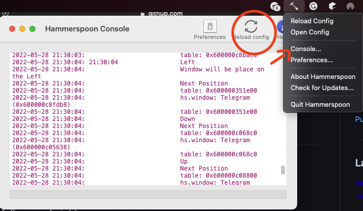

# .hammerspoon

Basic window management to macOSX


# Get start

Currently my automation only cover some basic commands to position the windows in some places on the screen. 

The command availables are:

<kbd>⌥</kbd> + <kbd>⌘</kbd> + <kbd>⌃</kbd> + <kbd>←</kbd> = Move widnow to left using full screen height

<kbd>⌥</kbd> + <kbd>⌘</kbd> + <kbd>⌃</kbd> + <kbd>→</kbd> = Move widnow to right using full screen height

<kbd>⌥</kbd> + <kbd>⌘</kbd> + <kbd>⌃</kbd> + <kbd>↓</kbd> = Move widnow to botton using full screen width

<kbd>⌥</kbd> + <kbd>⌘</kbd> + <kbd>⌃</kbd> + <kbd>↑</kbd> = Move widnow to top using full screen width

<kbd>⌥</kbd> + <kbd>⌘</kbd> + <kbd>⌃</kbd> + <kbd>m</kbd> = Maximize window

# Setup & Instalation

## 1. Hammerspoon

Tool to make automation to macOS interacting with native APIs using Lua script [see more](http://www.hammerspoon.org)

```sh
brew install hammerspoon --cask
```

## 2. Setup

```sh
git clone git@github.com:mendesbarreto/.hammerspoon.git ~/.hammerspoon
```

Relead config using hammerspoon as shown in the picture below:



## Updates

```sh
cd ~/.hammerspoon
git pull
```

